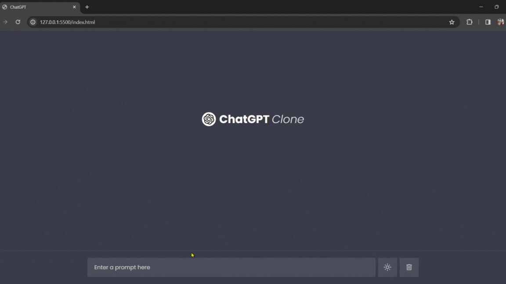

# ChatGPT-Clone
This project is a simple chat interface that interacts with the OpenAI API using GPT-3.5. It allows users to input prompts or questions, sends them to the API, receives responses, and displays them in a chat-like format.

## Features
- User Interaction: Users can input prompts or questions through a text input field and send them to the chat interface.
- Real-time Responses: Responses from the OpenAI API are displayed in real-time, simulating a conversation.
- Theme Toggle: Users can switch between light and dark themes to customize their chat experience.
- Delete Functionality: The chat interface provides an option to delete all chat messages.

## Technologies Used
- JavaScript: Programming language for interactive features and API interactions.
- HTML: Markup language for structuring the web page.
- CSS: Stylesheets for styling the user interface.
- OpenAI API: Integration with the GPT-3.5 model for generating chat responses.

## gif
# ChatGPT-Clone
